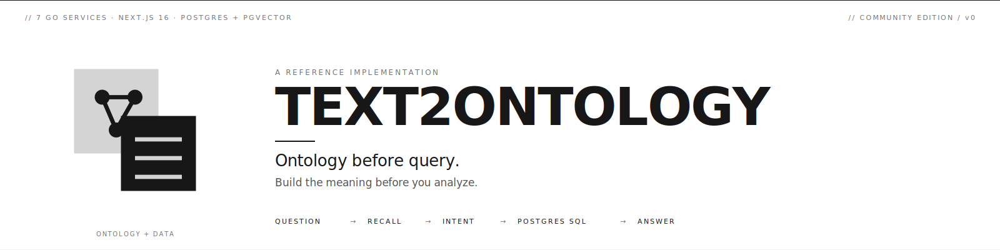

<p align="center">
  
</p>

# text2ontology

> **本体先于查询。** 在分析之前,先建立意义。

[English README](./README.md) · [宣言](./docs/manifesto/manifesto.zh.md) · [设计哲学](./docs/spec/design-philosophy.zh.md)

> 全部 5 篇核心文档均有 **中英双语**。文档导航见下方表格。

---

## 这是什么

text2ontology 是我对"**自然语言 → 数据分析**到底应该长什么样"的一份**实践答案**。它的设计动机来自一个非常具体的工程师视角问题:**当 AI 回答错了,我去哪里改?** 不是"谁的错" —— 那是甩锅。是"**这一处修完,以后不再撞同样形状的错**"。如果答案是"大模型每次输出都不一样、改无可改、retry 一下吧",那这套系统**根本不能交付到我手上** —— 我没办法对它的错误率负责。这是我在 Text2SQL / Agentic-Analyst 这条赛道里反复栽跟头之后,**逼出来**的一种 position。

> **大语言模型驱动的分析,不应该依赖 LLM 自由生成可执行查询(SQL / DAX / Pandas / 任何 DSL)。** LLM 应该往组织维护的**意图模板**里**填参数**,具体的可执行查询由 deterministic 编译器拼装。

一份结构化的"**你的数据意味着什么**"的地图 —— 也就是本体 —— 跟数据本身分开维护。LLM 选 intent、填参数;引擎把这两样编译成 SQL(或者任何数据层接受的东西)。每个错误都有**地址** —— 哪个 Intent、哪个 alias、哪条因果。改一次。下次不再撞同样形状的错。

如果你试过把 Text2SQL 推到 production、然后在列名歧义 / 口径模糊 / "这个答案到底对不对"这些问题上反复栽跟头 —— 这份代码就是我认为这件事的正确形状。

驱动整个设计的三个核心信念:

1. **AI 编程能成功是因为测试是 oracle,数据分析没有 oracle**。所以我们不让 AI 找"正确答案",而是让组织指定一个答案
2. **卖的是一致性,不是准确性**。"准确"假设有唯一答案,但业务问题是 under-determined 的。我们交付的是"同一个问题永远得到同一个答案"
3. **有界错误与无界幻觉是不同物种**。这套系统里每个错误都有地址(哪个 Intent、哪个 alias、哪条因果),改一次,永久修复

完整论述:[**本体先于查询**(宣言)](./docs/manifesto/manifesto.zh.md)

---

## 架构

6 个 Go 服务 + 一个 Next.js 前端,全部在 nginx 网关后面。**只有网关发布宿主端口 `28080`** —— 前端、6 个服务、Postgres 和可观测性栈都**仅在 Docker 内网可达**。一共 8 个自建镜像(网关 + 前端 + 6 Go 服务),外加 Postgres 与可观测性栈。下图端口为各服务的**内部**端口(不映射到宿主):

```
                    ┌─────────────────────────────────┐
       浏览器 ───▶  │     gateway   :28080            │   nginx —— 唯一对外入口
                    │     (反向代理, 按路径分发)        │   (其余全部仅 Docker 内网)
                    └──────────────┬──────────────────┘
                                   │
       ┌──────────────┬────────────┼────────────┬──────────────┐
       ▼              ▼            ▼            ▼              ▼
  frontend       backend-api   agent-server  recall-server  collector-server
  :8080          :8090         :8092         :8093          :8096
  Next.js 静态    Ontology CRUD AI Agent      三层召回        数据源接入:
                 Auth+Project  (查询/建模)   (EXACT/FUZZY    PBIT/Excel/CSV
                                              /VEC)          /SQLite/PG
                      │            │            │
                      ▼            ▼            ▼
              lakehouse-sql-server :8094     mcp-tools-server :8095
              SmartQuery 引擎                MCP 工具网关
              (本体 → SQL 编译器)            (lookup_od / execute_smartquery)
                      │
                      ▼
                    ┌─────────────────────────────────┐
                    │     Postgres + pgvector         │   compose 自带
                    │     (single source of truth)    │
                    └─────────────────────────────────┘
```

各服务职责(均为内部端口,仅网关对外):
- **gateway** `:28080`(对外) — nginx,唯一对外入口,按路径反代到前端 + 各服务
- **frontend** `:8080` — Next.js static export,nginx 静态服务
- **backend-api** `:8090` — `ont_*` / `lakehouse_*` 表 CRUD、登录、项目、导入导出
- **agent-server** `:8092` — Lakehouse Agent SSE(lakehouse / builder 两模式)
- **recall-server** `:8093` — 精确 + 向量 + 意图召回(over `ont_*`)
- **lakehouse-sql-server** `:8094` — SmartQuery 引擎(deterministic 本体 → SQL 编译器)。LLM 在有限集里选 `(OD, Intent, Keyword)`;引擎顺着 `ont_link` 预定义的关系自动拼 JOIN —— **LLM 永远看不见表,也看不见 JOIN**。
- **mcp-tools-server** `:8095` — MCP 工具网关(供 Claude Code 等外部客户端调用)
- **collector-server** `:8096` — 唯一数据入口(PBI/Postgres/File + wizard 状态机)

详细架构见:[**设计哲学**](./docs/spec/design-philosophy.zh.md)

---

## 快速开始

**前置**:Docker(自带 `docker compose` v2+)。

两条命令。唯一的 `docker-compose.yml` 会从 GHCR 拉取预构建多架构镜像并启动整套 —— schema、最小权限 DB 角色、可观测性栈全部自动接线。默认账号 `admin / admin` 仅限本地试用 —— 暴露到 localhost 之外前请加固(见下方「生产级部署」)。

```bash
# 1. 克隆
git clone https://github.com/agentofreef/text2ontology
cd text2ontology

# 2. 启动整套(拉镜像 + apply schema,首次 1-3 分钟)
docker compose up -d

# 3. 验证(网关是唯一对外入口)
curl -fsS http://localhost:28080/healthz   # -> ok

# 4. 打开
open http://localhost:28080
```

浏览器访问 `http://localhost:28080`,用 `admin` / `admin` 登录。无需 `.env`、无需任何参数 —— 每个密钥在 `docker-compose.yml` 里都有安全的本地默认值。

**要使用 Agent**:用 `admin` / `.env.shared` 里设的 `ADMIN_PASSWORD` 登录后,在 `/settings/llm-config` 添加至少一个 chat 模型(Claude / OpenAI / DeepSeek / Qwen,填 vendor + base URL + API key + model 名),激活为 chat role。LLM 凭据存在数据库,**无需改 env 也无需重启容器**。

**当前状态**:这套 setup 能把系统正常起来,但**未导入数据前 UI 是空的**。数据导入(PBIT / Excel / CSV / Postgres 镜像)见 `docs/`。

---

## 生产级部署(加固版,单入口)

整个项目只有一个 compose 文件 —— `docker-compose.yml` —— 它本身就是加固的单入口拓扑。只有 nginx `gateway` 发布宿主端口(`28080`);Postgres、6 个 Go 服务、以及整套可观测性栈(otel-collector / Jaeger / Prometheus / Grafana / Alertmanager)都**只在 Docker 内网可达**(观测 UI 绑 `127.0.0.1` 供本机查看)。容器非 root、每服务 CPU/内存/PID 限制、HTTP 超时 + 连接池上限、优雅退出、panic-recover、最小权限 DB 角色、一次性 `db-migrate` runner —— 全部内建。

「快速开始」用的就是这套,只是带**安全的本地默认值**。对外暴露前,设强密钥并打开 fail-closed 强制:

### 1. 设强密钥 + 打开强制

```bash
cp .env.example .env
```

`.env` 会被 docker compose 自动读取。把每个密钥设成强随机值,并打开强制:

| 变量 | 用途 |
|---|---|
| `POSTGRES_PASSWORD` | Postgres 超级用户 + 所有 scoped 角色密码(用 hex) |
| `ADMIN_PASSWORD` | 初始 `admin` 网页登录密码 |
| `AUTH_TOKEN_SECRET` | 用户会话 token 的 HMAC 密钥(≥ 32 字符) |
| `INTERNAL_TOKEN` | 服务间认证 token |
| `GRAFANA_ADMIN_PASSWORD` | Grafana 管理员登录 |
| `REQUIRE_STRONG_SECRETS=true` | 任何弱/占位密钥都让服务**拒绝启动** |

用 `openssl rand -hex 32` 生成强随机值。打开 `REQUIRE_STRONG_SECRETS=true` 后,任何残留的 `change_me` / `admin` 都会让服务拒绝启动 —— 配错的部署会**大声失败**而不是带着不安全配置裸奔。

### 2. 启动并验证

```bash
docker compose up -d                                     # 拉取预构建 :latest 镜像
curl -fsS http://localhost:28080/healthz                 # -> ok
curl -sI  http://localhost:28080/ | grep -i location     # -> 302 Location: /lakehouse/(相对跳转)
```

浏览器打开 **http://localhost:28080**,用 `admin` + 你设的 `ADMIN_PASSWORD` 登录,然后在 `/settings/llm-config` 添加 chat 模型(同「快速开始」说明)。

### 运维须知

- **TLS**——网关在 `28080` 走明文 HTTP;请在前面用反向代理终结 TLS(或给 `services/gateway/nginx.conf` 加一个 TLS `server {}`)。HSTS 头会发,但明文 HTTP 下是 no-op。
- **收紧对外端口**——改 `docker-compose.yml` 里网关的 `ports:`(如绑回环 `127.0.0.1:28080:8080`,由你自己的 TLS 代理转发,不暴露到局域网)。
- **本地构建 / 发布镜像**——用户直接拉预构建镜像;维护者本地构建用 `make build`(逐服务 `docker build`)。CI 在每次推到 `main` 时发布多架构(amd64 + arm64)`:latest` 到 `ghcr.io/agentofreef/text2ontology-*`。
- **生命周期**
  ```bash
  docker compose logs -f gateway
  docker compose down            # 停止,保留数据库卷
  docker compose down -v         # 停止并清空数据库卷
  git pull && docker compose pull && docker compose up -d   # 更新到最新镜像
  ```

---

## 在开始之前的几句话

"AI Agent + 你的数据库"这条赛道上,主流话术大致是:把数据库连接串和 schema metadata 喂给 Agent,它就能回答一切。我自己**花了很长时间**想让那条路走通 —— 换过不同的形态、不同的 stack —— **看着它每次以同样的方式崩**。所以,在你把周末交给这个项目之前,先说几句实在的。

Schema 不知道你的业务**是什么意思**。`INFORMATION_SCHEMA.COLUMNS` 里没有"早单是 `status='CONFIRMED'` 而不是 `status='SHIPPED'`"。没有"Q1 截止日是 3 月 14 日不是 15 日"。没有"这个客户在 2025 迁移之后被错分类了"。这些**活在业务人员脑子里**、**活在审计历史里**、**活在没人写下来的 exception list 里** —— LLM 光看列是**捞不出来**的。

所以这套项目的形态是**反过来的**:**是组织自己花时间沉淀出一套 curated ontology,AI 只是读它**。不是 auto-learning。更接近"招一个需要 onboarding 的新分析师 —— 区别是这位分析师一旦教过就不会忘"。

### 几个值得先坐下来想清楚的问题

这些**不是 requirement** —— 不回答系统也照样起得来。它们只是我反复看到大家(包括我自己)在前期不清不楚的时候,撞同一面墙的地方:

1. 你们公司的业务**到底在干什么**?你期待用 AI 分析出**今天分析不出来**的什么东西?
2. 你的数据源**有多干净**?半截迁移、坏 FK、说了两个季度"下次再修"的脏列?
3. 你愿不愿意花时间把基础写下来 —— "早单"到底指什么?"核心客户"按哪个字段?Q1 截止到几月几号?
4. 你们团队脑子里的那些业务知识 —— 定义、例外规则、校准笔记 —— **有没有写在某个共享的地方**?

任何一条感觉模糊,通常那才是最值得**先去花时间**的地方。不是系统要求你这样,是这事的时间本来就花在那儿。

### 真上手之后

克隆,`docker compose up`,连数据源。打开 **builder 模式**,用人话把你的业务讲给 Agent 听。它建出来的本体是个**草稿** —— activate 之前先读一遍。**如果你没法跟同事讲清楚为什么这个 OD 或者 Intent 应该存在**,通常说明**上游的讨论还没做完**,这时候 activate 不是最优解。

然后试问一个问题。第一个答案大概率不对。**正常**。

- **keyword triage 页面**(`/lakehouse/ontology/lakehouse-keyword-triage`)是修分词的地方 —— 确保 LLM 看到的词跟你们团队用的词是同一个东西。
- **metric intents 页面**(`/lakehouse/ontology/lakehouse-metric-intents`)是当现有 Intent 都覆盖不到时,新建一个全新分析维度的地方。

跟传统 BI 比,这套**确实笨重**。要 curate、要标注、要 activate。不会十五分钟掉一个 dashboard 给你。

我自己的体验是:**值得的部分是 —— 一个答案修好之后,它就一直是对的**。每个错误都有地址 —— **哪个 Intent、哪个 alias、哪条因果** —— 在那儿修一次,下个礼拜不会撞同样形状的错。这是传统 BI 给不了的东西,也是我做这套**主要给自己用**的原因。

如果这跟你的工作形态对得上,**我很高兴你用**。如果你期待的是黑盒魔法,那可能别的工具更合适 —— 这是**实话,不是看不起谁**。

---

## 文档导航

| 主题 | 中文 | English |
|---|---|---|
| **宣言** —— 本体先于查询 | [中文](./docs/manifesto/manifesto.zh.md) | [EN](./docs/manifesto/manifesto.en.md) |
| **设计哲学** —— 整套架构详解 | [中文](./docs/spec/design-philosophy.zh.md) | [EN](./docs/spec/design-philosophy.en.md) |
| **责任即利润率** —— 商业 thesis | [中文](./docs/essays/responsibility-as-moat.zh.md) | [EN](./docs/essays/responsibility-as-moat.en.md) |
| **AI Agentic 错觉** —— 主流路线反方解构 | [中文](./docs/essays/ai-agentic-illusion.zh.md) | [EN](./docs/essays/ai-agentic-illusion.en.md) |
| **业务本体工程师** —— 即将出现的新职业 | [中文](./docs/essays/business-ontology-engineer.zh.md) | [EN](./docs/essays/business-ontology-engineer.en.md) |

内部开发文档见 [`docs/`](./docs/)。

---

## 两种 Agent 模式

text2ontology 在同一个入口运行两种独立 Agent 模式,由 agent thread 上的 `agent_type` 字段决定(一旦写入不可改):

| 模式 | 用途 |
|---|---|
| **lakehouse**(查询) | 自然语言 → SmartQuery → 答案 |
| **builder**(建模) | 访谈式 OD / Intent / Link 构建,人工 activate |

各模式的工具集详见 [`docs/spec/design-philosophy.zh.md`](./docs/spec/design-philosophy.zh.md) 第四节。

---

## 我从 Palantir 的本体方案里拿了什么 —— 和故意不拿的部分

我读了仓库根目录的 [*The Palantir Impact*](./the-palantir-impact_en.md)(HN 上发的一份 CC-BY 电子书,[HN thread 大多是质疑](https://news.ycombinator.com/from?site=github.com/leading-ai-io))。一坐下读到两个相反的声音,值得把这套仓库相对它的位置写下来。

### 我对 Palantir 的判读

书里"本体 = 范式革命"那套话术,**一半是营销**。HN thread 里最 sharp 的几条批评基本是对的:

- *"不就是 view、materialized view、UDF、stored procedure 套了一层企业话术么"* —— 公允
- 本体这个概念**不新**。Aristotle 早就在做。OWL / RDF 在 20 年前做得更严格(transitive properties、decidability 证明、DL 整个家族)
- Palantir 真正的护城河是**运营级集成**(Forward Deployed Engineers 常驻客户现场)+ **国防系关系**,不是技术新意
- 产品剥掉神秘感剩下的是:"易用 UX + 图存储 + 一种别人不愿意接的政府生意"

但**值得借鉴**的设计仍然有四条:

1. **Semantics + Kinetics 一起建模。** 大多数数据系统只到"Object / Property / Link"(名词那一半)。Palantir 坚持把 Action / Function / Dynamic-Security(动词那一半)放进同一个模型 —— 这是对的。
2. **本体变更走 Branch + Proposal。** schema 改动走 git-PR 流程 —— branch、test、review、merge,Approvals app 支持多方签字。
3. **Action Log。** 每一次写自动变成一个永久 object,审计在模型层封死,不甩给应用层。
4. **AI 是受约束的执行者。** LLM 只能调预定义的 Action,幻觉**靠设计**被边界化。这跟[宣言](./docs/manifesto/manifesto.zh.md)里讲的"有界错误 vs 无界幻觉"是不同血统得出的同一结论。

### 我这套相对它的位置

| 能力 | Palantir Foundry | text2ontology |
|---|---|---|
| Object / Property / Link | ✓ | ✓ |
| Knowledge / Causality / Learned-fact | 部分(走 Functions) | ✓ 显式(`ont_knowledge` / `ont_causality` / `ont_learned_fact`) |
| Metric / Intent 模板 | 走 Functions | ✓ `lakehouse_metric_intent` |
| **NL → 本体入口层**(三层召回 + 线程 Ledger) | 在 AIP 里,黑盒 | ✓ 开源:EXACT / FUZZY / VEC + ledger |
| 强制双层(结构 + 解释,向量化) | 隐含 | ✓ 每个本体单元强制 |
| **Actions / 写事务(Kinetics)** | ✓ 核心 | ✗ —— 系统只读 |
| 动态安全(action 级 / property 级 RBAC) | ✓ | 部分(`project_member` + role) |
| **本体变更走 Branch / Proposal** | ✓ Foundry Branching | 部分 —— Builder 模式的 `mark=false → 人工 activate` 同构 |
| Action Log(每次写自动建审计 object) | ✓ | ✗ |
| 实时流式索引 | ✓ Funnel streaming | ✗ —— 仅批量(collector-server) |
| AI agent 通过 branch 提议 | ✓ AI FDE | ✓ Builder mode 对 OD / Intent / Link 做这件事 |
| 数字孪生 / 写回源系统 | ✓ | ✗ |

### 我打算做的

1. **本体变更走 Branch / Proposal。** Builder + Analyst mode 已经有"propose → 人工 activate"雏形;把改 `semantic_sql` / 改 `Intent` 也走同一条 review 路径,而不是直接 UPDATE。
2. **`ont_*` / `lakehouse_*` 全表 Action Log。** 每个 INSERT / UPDATE / DELETE 写入一个永久审计表 —— 正好补[设计哲学 §6 "两个未来工作"](./docs/spec/design-philosophy.zh.md)里那个缺口。

### 我不打算做的,以及原因

1. **Actions / 写回(Kinetics 那一半)。** 我是一个人。一个能自动下单、停产线、付保险金的系统是一个**完全不同 category** 的投入 —— 那是国防承包商带 FDE 常驻客户现场的范畴。这套仓库的 thesis 是"NL → 数据分析应该长什么样" —— 读侧,不是 "organizational OS"。
2. **实时流式索引。** collector-server 的批量足以解决"答案对不对"这件事。Streaming 是运维问题,在本体问题下游。
3. **数字孪生。** 同理 —— 跨过了"数据意味着什么"到"业务做什么"的边界,超出本仓库范围。
4. **Palantir 那种行文。** *"积重难返的 silo 顽疾"*、*"在极端环境中淬炼"*、*"将幻觉边界化到极限"* —— 每次我自己往这种语气滑,就把段落重写。HN thread 对那本书的反应,**就是我希望这份 README 不要拿到的反应**。

---

## Roadmap

每个优先级桶里的条目大致按"我下一个会动哪个"排序。"不做"那些不是"还没轮到",是**故意划出 scope 之外**。

### ✅ Shipped — 当前状态(≈ v0.1)

| 板块 | 已有 |
|---|---|
| Foundation | 6 个 Go 服务 + Next.js frontend;4 层 hexagonal 架构;Postgres + pgvector;单一加固 docker compose(单入口);GHCR 8 镜像 |
| Ontology core | 7 concepts(OD / Property / OK / OL / Link / Causality / Intent / Keyword);三层召回(EXACT / FUZZY / VEC);线程记忆账本(Ledger);SmartQuery 引擎 — deterministic 本体 → SQL;每个 OD 一段 `semantic_sql`,跨多张物理表 |
| Agent | 两种模式(lakehouse / builder);≥3 轮访谈服务端硬闸;`mark=false → 人工 activate` 生命周期 |
| 回归测试 | 命名 test suite + 业务问题集(`ont_test_suite` / `ont_test_case`);后台 runner 拿 suite 跑活体 stack;多次 run 对比在 `/ontology/lakehouse-agent/dataset-testing` |
| Security | HMAC 签名 token + 迭代 SHA-256 密码;`project_member` 访问范围;7 处 SQL 注入用 `pq.QuoteIdentifier` 堵掉;SQL passthrough 跨 schema 逃逸阻断;文件上传 path traversal 修;fail-closed CORS;LLM key 详情 GET 时 mask |
| Docs | README 中英;5 篇 essay 中英(manifesto、design-philosophy、responsibility-as-moat、ai-agentic-illusion、business-ontology-engineer);Palantir 对比;"不会有魔法发生" |

### 🚧 Next — v0.2 候选

| 优先级 | 条目 | 备注 |
|---|---|---|
| 1 | **Ontology audit log** | `ont_*` / `lakehouse_*` 每次 INSERT / UPDATE / DELETE 写入永久审计表 —— 谁、何时、改了什么、改前是什么。补 manifesto 里"原则 7 半完成态"的缺口 |
| 1 | **本体变更走 Branch / Proposal** | 改 `semantic_sql` 或 `Intent` 走 branch → review → merge,不再直接 `UPDATE` —— 借 Palantir Foundry Branching 思路 |
| 2 | **OL → OK 自动沉淀** | 聚类相似 OL(`confidence='pending'`),AI 提议候选 OK,BOE 审核通过后入 OK 表并带 evidence 反指源 OL。design-philosophy 里标注的"未来工作" |
| 2 | **Activate 前验证器** | `mark=true` 前的轻量可选闸门:semantic_sql 能执行、grain 无重复、FK orphan 率 < 阈值。删掉的 L3 validator 的精简复刻 |
| 3 | **基于 dataset-testing 的公开 benchmark** | 出一套默认 suite + 评分标准,任何人跑自己的 stack 对照基线、看版本间回归 |
| 3 | **英文 / 多语言分词器** | 当前 `simple_split` 偏中文;英文需独立 splitter 链 |

### 🚫 Won't do —— 以及原因

| 条目 | 原因 |
|---|---|
| 流式索引 | `collector-server` 批量足够解决答案正确性问题。Streaming 是运维问题,在 ontology 问题下游 |
| Digital twin / 写回源系统 | 跨过了"数据意味着什么"到"业务做什么"的边界 —— **完全不同 category 的系统** |
| SaaS hosting | Self-hosted by design |
| Mobile / desktop app | Frontend 只做 web,by design |

---

## 贡献

这个仓库就是我**实际开发**的地方 —— 没有私有 mirror、没有定时同步。PR、issue、discussion 我看到就 review。完整流程见 [CONTRIBUTING.md](./CONTRIBUTING.md)。

安全问题见 [SECURITY.md](./SECURITY.md),**请勿**公开 issue 报告漏洞。

---

## License

代码:Apache 2.0,见 [LICENSE](./LICENSE)。
文档(宣言、设计哲学、随笔):[CC BY 4.0](https://creativecommons.org/licenses/by/4.0/)。

---

## 联系

- 邮箱:<redeemer@vip.163.com>
- GitHub:[@agentofreef](https://github.com/agentofreef)
- 网站:[text2ontology.com](https://text2ontology.com)
- RSS:[text2ontology.com/zh/rss.xml](https://text2ontology.com/zh/rss.xml)([English](https://text2ontology.com/rss.xml))
- Essay 评论区在网页每篇文章下方(GitHub Discussions / Giscus)。bug 或功能请求请开 GitHub issue;安全问题见 [SECURITY.md](./SECURITY.md)。

---

## 作者

由 [AgentOfReef](https://github.com/agentofreef) 创建并维护。更多内容见 [text2ontology.com](https://text2ontology.com)。
